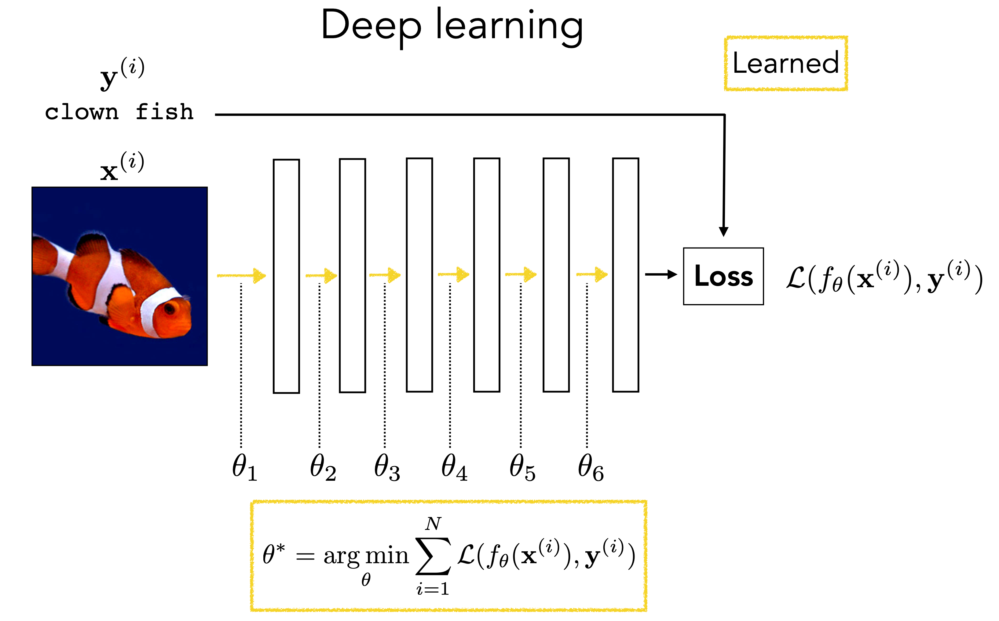
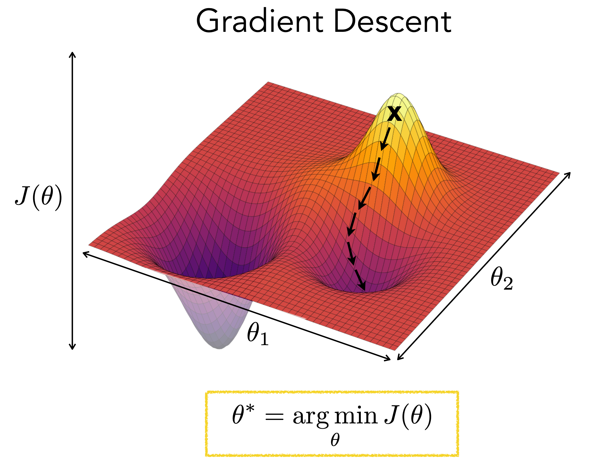
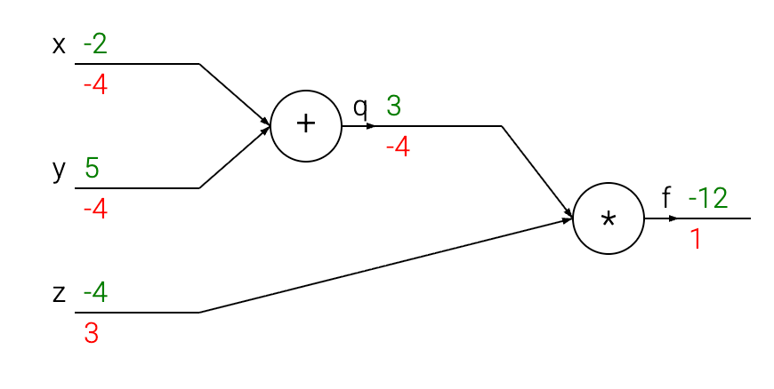

# Lecture 1 深度学习基础

[TOC]

## 1 从监督学习任务开始

 
图 1：深度学习

在本节的最开始，我们先聚焦一个基础的问题：在深度学习中，我们到底想让机器学会什么？对很多任务来说，最小的共同框架都是一样的：给定输入，希望系统产出某种有用输出。输入可以是图像、语音、文本，也可以是更抽象的传感器读数；输出可以是类别、连续数值、一个序列，或者某种结构化决策。深度学习真正接手的，往往不是规则已经写得很清楚的映射，而是那些目标明确、但规则难以手工枚举的复杂映射。

### 1.1 输入到输出的映射

从最朴素的角度看，一个学习系统做的事情就是接收输入 $x$，输出预测 $\hat{y}$。如果输入是一张胸片，输出可能是“是否存在病灶”；如果输入是一段英文句子，输出可能是对应的中文翻译；如果输入是房屋面积、地段和楼龄，输出可能是价格估计。表面上这些任务差别很大，但都可以先写成同一种形式：我们希望找到一个函数，把输入映射到关心的输出。

这种抽象的价值在于，它先把任务外观拿掉，只保留最核心的计算目标。我们不必一开始就区分这是视觉、语言还是生物信息学问题，而是先问三件事：输入是什么对象，输出是什么对象，中间需要学到怎样的对应关系。后面所谓模型、参数、损失函数和优化算法，都是围绕这件事展开的。

同样叫“输入到输出”，难度却可能天差地别。把温度从摄氏度换算到华氏度当然也是映射，但规则已经完全已知；根据图像判断是不是一只猫也是映射，可它背后牵涉纹理、姿态、背景、遮挡和视角变化等大量因素。深度学习真正擅长的，往往是后者这种规则难写、模式复杂、但又确实存在统计结构的任务。

### 1.2 数据、标签与学习目标

监督学习把“输入到输出映射”再往前推进了一步。它假设我们手里已经有一批样本，每个样本都带着目标输出，也就是成对出现的数据 $(x, y)$。这里的 $y$ 常被叫作 **标签 （Label）**，但它不一定总是离散类别。做猫狗分类时，标签可以是 `cat` 或 `dog`；做房价预测时，标签是一个连续实数；做机器翻译时，标签是一整段目标语言句子。

无论标签长什么样，本质上都在回答同一个问题：对于这个输入，我们希望系统输出什么。于是学习目标也就明确下来：找到一个函数，使它在已有样本上给出的预测尽量接近这些标签。这样一来，“学习”就不再是一句模糊口号，而是变成了一个可以定义误差、比较模型、并通过训练不断改进的过程。

这里还要记住一个边界。标签并不天然等于世界真相。很多真实任务里，标签本身就带噪声，或者只是我们真正目标的一种近似代理。点击率预测里的“是否点击”只是一个可观测信号，并不完全等于“用户是否满意”；医学数据里的人工标注也可能存在分歧。因此，监督学习更准确的说法是：在给定数据和标签定义下，学出一个足以完成当前任务的映射。

### 1.3 为什么复杂任务难以依赖手工规则

如果任务只是少量、清晰、稳定的规则组合，我们完全可以手写程序。税率计算、日期格式转换、单位换算都更适合传统程序设计，因为人能够直接把规则写出来。但很多任务恰恰卡在这里：人知道任务目标，却说不清完整规则。

以图像分类为例，我们会说“猫有耳朵、有胡须、有四条腿”，但这些描述远远不够。猫可能侧身、蜷缩、被遮挡、在逆光里，甚至只露出脸的一部分；狗也可能出现类似姿态和纹理。你很难写出一串 if-else，把所有情况都覆盖。语言任务也是一样。我们能理解一句话大概在说什么，却很难穷举其中所有语义变化、歧义消解和上下文依赖。

监督学习吸引人的地方就在这里：既然人很难手工写出规则，那就换一种思路，不直接编规则，而是收集足够多的样本，让系统自己从数据里调整出一个有效映射。深度学习进一步推动了这件事，因为它提供了一类足够灵活的函数族，能够在大量数据上逐步逼近这些复杂规律。换句话说，我们从“人设计规则”转向“人设计可学习的函数形式和训练过程”。

这里还藏着一个更深的判断：复杂任务并不意味着毫无结构。深度学习能工作的前提，恰恰是现实世界虽然复杂，但不是完全随机的。图像里有局部相关性，语言里有组合结构，生物序列里有演化约束，物理系统里也有稳定规律。我们之所以敢把任务交给数据驱动的方法，不是因为问题简单，而是因为问题虽然复杂，却仍然存在可被模型捕捉的统计结构。

### 1.4 训练集 (Training Set)、测试集 (Test Set) 与学习的基本含义

到这里还差最后一个基本问题：如果模型在手头数据上表现很好，这就叫“学会了”吗？还不够。真正重要的不是它能否记住训练样本，而是当它看到新的、没见过的样本时，是否还能做出合理预测。这就是为什么要区分训练集和测试集。

训练集是模型用来调整参数的数据。模型在这上面反复比较预测和标签的差距，不断更新参数，目标是把训练误差降下来。测试集则是另一批不参与参数更新的数据，它更像一次外部检查：模型离开熟悉样本后，是否还能维持好的表现。监督学习真正想要小的，并不只是训练集上的经验风险，而是新样本上的总体风险。

这一区分能帮我们看清两类完全不同的失败。第一类是训练集和测试集上都表现不好，这往往说明模型表达能力不足、输入表示不对，或者训练过程本身没有跑顺。第二类是模型在训练集上几乎完美，但到了测试集就明显变差，这说明它更像是在记住训练数据，而不是抓住了可迁移的规律，这就是常说的过拟合。

所以，这里可以先把“学习”理解成一件很具体的事：利用训练数据找到一个映射函数，使它不仅能解释已有样本，还能在未来样本上继续工作。下面我们从最简单的神经网络开始，把这个映射真正拆成若干个最小、必要的部件，看看一个神经网络究竟由什么构成。
 
>**训练集 (training set)：** 用于训练模型参数的数据集，即供学习算法直接用来拟合模型的数据。
>
>**验证集 (validation set)：** 用于选择模型、调整超参数、确定训练过程中的设置，并对不同候选模型进行比较的数据集；它不用于直接拟合模型参数。
>
>**测试集 (test set)：** 与训练和模型选择过程分离、仅用于最终评估模型泛化能力的数据集。

## 2 最小神经网络的基本组成

前面已经把任务压成了“从输入学到输出”的映射。接下来要把这件事再往下拆一层：一个最小神经网络到底由哪些部件组成？更稳妥的做法不是一上来堆很多层，而是先把最基本的技术骨架看清楚。输入怎样表示，线性层在做什么，非线性为什么不可少，输出层和损失函数又分别承担什么角色。把这条链条看清楚，后面训练过程才不会像黑箱。

### 2.1 输入表示与特征

神经网络并不直接接触“猫”“句子”“房价”这些语义对象，它接触到的始终是一个数值对象 $x$。在最简单的监督学习设置里，可以先把单个样本写成

$$
x \in \mathbb{R}^{d_{in}},
$$

其中 $d_{in}$ 表示输入维度。对二维 toy 分类任务来说，$d_{in} = 2$；对一张 $28 \times 28$ 的灰度图，如果先展平，$d_{in} = 784$；对文本来说，更常见的是先把 token 映射成 embedding，再得到一个向量序列而不是单个标量向量。

这里最值得抓住的机制点是：输入表示不是装饰，它直接决定了模型最开始“看见”的是什么。如果把图片写成像素矩阵，网络最初处理的是局部亮度模式；如果把一个词写成 embedding，网络最初处理的是一个连续向量，而不是词典里的编号。也就是说，输入表示在技术上回答的是“进入第一层线性变换之前，数据被放在什么坐标系里”。

“特征”这个词也可以在这里先落成一个很机械的含义。原始输入里的每个坐标都可以看成最初的特征，而后续隐藏层产生的新坐标，则是模型从数据里重新构造出来的特征。这样后面说“网络在学习表示”时，就不只是抽象口号，而是“网络在不断把 $x$ 变成新的坐标系”。

### 2.2 线性层：可学习的仿射变换

最基本的可学习层通常是线性层。对单个样本来说，它的形式可以写成

$$
z = Wx + b .
$$

这里 $x \in \mathbb{R}^{d_{in}}$，$W \in \mathbb{R}^{d_{out} \times d_{in}}$，$b \in \mathbb{R}^{d_{out}}$，输出 $z \in \mathbb{R}^{d_{out}}$。如果把它展开到坐标级别，第 $j$ 个输出维度满足

$$
z_j = \sum_i W_{ji} x_i + b_j .
$$

这不是单纯的符号游戏，而是在明确每个输出维度都是输入各维的加权组合，再加上一个可学习偏置。

从机制上看，线性层做了两件事。第一，它重新组合输入坐标，把原来分散在不同维度里的信息混合起来。第二，它通过学习权重矩阵 $W$，决定哪些方向应该被放大，哪些方向应该被抑制。把矩阵的每一行看成一个“检测器”会比较直观：第 $j$ 行权重决定了第 $j$ 个输出神经元究竟对什么输入模式敏感。

但线性层也有明确边界。即使堆很多层，只要中间没有非线性，它们最终都能折叠成一个更大的仿射变换。比如两层线性复合可以写成

$$
z^{(2)} = W_2(W_1x + b_1) + b_2 = (W_2W_1)x + (W_2b_1 + b_2) .
$$

也就是说，层数变多了，参数化方式变复杂了，但函数类别并没有跳出“整体仍然是一个仿射映射”这件事。这个结论正是下一小节为什么一定要引入非线性的技术起点。

### 2.3 非线性：突破线性模型的表达限制

如果网络里只有线性层，那么多层复合仍然等价于一层线性层，这件事刚才已经直接算出来了。神经网络要获得真正新的表达能力，中间就必须插入非线性操作。最常见的例子是 ReLU：

$$
\mathrm{ReLU}(z) = \max(0, z) .
$$

它对每个坐标单独作用，所以如果 $z$ 是向量，那么 $h = \mathrm{ReLU}(z)$ 表示对每个分量分别做“负的截成 0，正的保持不变”。

这个公式虽然简单，但机制上非常关键。只要在线性层之间插入这样的逐点非线性，整个网络就不再能被压成单一矩阵乘法。不同输入会激活不同的神经元子集，于是网络在不同输入区域上可以表现成不同的局部线性函数。也正因为如此，ReLU 网络常被看成一种分段线性函数族。

这里也能顺手看懂为什么两层 ReLU MLP 会和“逼近能力”联系在一起。关键并不是某个激活函数本身有多神奇，而是“线性组合 + 逐点非线性 + 再线性组合”已经足以拼出相当复杂的分段结构。没有非线性，网络只能整体做一次线性扭曲；有了非线性，网络才能在输入空间的不同区域采取不同局部行为。

不过这里也要保留一个边界：ReLU 让网络“能表示”，不等于训练就“容易学到”。表示能力、优化难度和泛化是三件相关但不同的事，后面还会把它们重新拆开。

### 2.4 输出层：不同任务的输出形式

输出层的核心问题不是“最后一层长什么样”，而是“任务需要什么对象，我们就输出什么对象”。因此，输出层通常是隐藏表示到目标空间的最后一次投影，但这个目标空间会随着任务类型变化。

#### 2.4.1 回归任务

如果任务是回归，我们想预测的是连续值，那么一个常见做法就是让最后一层直接输出实数：

$$
\hat{y} = W_{\mathrm{out}} h + b_{\mathrm{out}} .
$$

如果只预测一个标量，那么 $W_{\mathrm{out}}$ 可以看成一行向量，$\hat{y} \in \mathbb{R}$。在这种情况下，输出层没有必要再做复杂变换，因为我们关心的就是“当前隐藏表示对应的数值估计是多少”。

机制上，可以把回归任务的输出层理解成一个读出头。前面的层负责把输入组织成有用表示，最后这一层负责把表示投影到目标量上。至于这个数是房价、温度还是某个物理量，并不会改变这种线性读出的基本结构。

#### 2.4.2 分类任务

如果任务是分类，更自然的中间对象通常不是概率，而是一组分数，也就是 logits。对 $C$ 类分类，可以写成

$$
z = W_{\mathrm{out}} h + b_{\mathrm{out}}, \quad z \in \mathbb{R}^C .
$$

其中 $z_c$ 表示模型对第 $c$ 类的支持程度。真正做预测时，最直接的是取

$$
\hat{y} = \arg\max_c z_c .
$$

如果还需要概率解释，再把 logits 送进 softmax：

$$
p(y=c \mid x) = \frac{\exp(z_c)}{\sum_k \exp(z_k)} .
$$

模型先产生 logits，再由 softmax 把它们正规化成概率分布。优化的过程就是让正确类别的 logit 相对其他类别更大。

### 2.5 损失函数：从预测误差到优化目标

到这里，网络已经能从输入走到预测了，但训练还缺最后一个部件：怎样把“预测得好不好”写成一个可以优化的数？这正是损失函数的作用。损失函数把预测和标签之间的偏差压成一个标量，并把这个标量接到后面的梯度计算上。

对回归任务，一个最常见的选择是平方误差：

$$
L_{\mathrm{reg}} = \lVert \hat{y} - y \rVert_2^2 .
$$

它的好处是形式简单，而且导数也很直接，误差越大，梯度信号通常也越强。对分类任务，如果使用 logits，常见选择是交叉熵。以多分类为例，可以写成

$$
L_{\mathrm{ce}} = -\log p(y \mid x) ,
$$

而这里的 $p(y \mid x)$ 又来自上一小节的 softmax。二分类时，也常见写法是先输出一个 logit $z$，再令 $p = \sigma(z)$，其中

$$
\sigma(z) = \frac{1}{1 + \exp(-z)} ,
$$

然后使用二元交叉熵。

更重要的是机制关系：输出层决定模型往哪里看，损失函数决定模型怎样为这个输出负责。没有损失，模型只是一个会算数的函数；有了损失，它才变成一个能够告诉优化器“当前方向好不好”的学习系统。

如果把这一节停在这里，网络仍然像一堆分散的零件。为了把这些部件真正装成一个会工作的最小分类器，先看一个更小的例子会更有帮助：把线性层和阈值拼在一起，会得到什么样的模型？

## 3 感知机：单个神经元的简单模型

如果把上一节的线性层再往前收缩一步，可以得到一个更接近“单个神经元”的最小模型：感知机。对一个二分类任务来说，我们先计算

$$
z = w^T x + b ,
$$

再把这个线性输出送进一个最简单的阈值规则：

$$
y = \begin{cases}
1, & z > 0 \\
0, & z \le 0
\end{cases}
$$

这件事的几何意义非常直接。参数 $w$ 和 $b$ 决定了一个边界

$$
w^T x + b = 0 ,
$$

当输入落在这条边界的一侧时，模型输出 1；落在另一侧时，模型输出 0。于是，感知机就成了一个最小分类器：在二维平面里，它画出的是一条直线；在三维空间里，它对应一个平面；在更高维里，它对应一个超平面。这样一来，前面“线性层会对某些输入方向更敏感”这句话就不只是代数描述了，而是可以直接理解成：模型正在试图找到一个合适的线性分界面，把不同类别分开。

 
图 2：单个感知机可以看成“线性层 + 阈值激活”的最小组合。

我们考虑一个有两个输入 $x_1$ 和 $x_2$、一个输出 $y$ 的感知机。令输入连接的权重为 $w_1 = 2$、$w_2 = 1$，并且 $b = 0$。$z$ 和 $y$ 作为 $x_1$ 与 $x_2$ 的函数时的取值如下图所示。

 
图 3：感知机中隐藏单元 z 和输出单元 y 作为输入数据函数时的取值。

所以感知机的行为确实像一个分类器，但接下来的问题马上变成了：它的参数怎么学出来？思路并不复杂。给定数据 $\{x^{(i)}, y^{(i)}\}_{i=1}^{N}$，我们调节权重 $w$ 和偏置 $b$，以最小化一个分类损失 $L$，这个损失度量分类错误的数量：

$$
w^*, b^* =
\arg\min_{w,b}
\frac{1}{N}\sum_{i=1}^{N}
L\bigl(w^T x^{(i)} + b,\ y^{(i)}\bigr)
$$

在下图中，这个优化过程对应于不断平移和旋转决策边界，直到找到一条能够把标记为 $y=0$ 的数据与标记为 $y=1$ 的数据分开的直线。

 
图 4：感知机可能的不同决策面

感知机的价值不在于它足够强，而在于它把“表示一个分类边界”和“通过损失来学习参数”这两件事第一次紧紧绑在了一起。有了这个最小例子，下面就可以把训练真正写成一个完整闭环：前向计算、损失、反向传播和参数更新到底是怎样一环扣一环发生的。

## 4 神经网络的训练过程

前一部分已经把网络拆成了输入、层、激活、输出和损失，也用感知机看到了“参数可以被学习”这件事。接下来要把这些对象真正连成一个训练闭环。深度学习训练并不是一句“不断调参数”就结束了，而是一个可以明确写出计算步骤的循环：先做前向计算得到预测和损失，再通过反向传播求出各参数对损失的影响，最后用优化算法更新参数。

### 4.1 前向计算：从输入到预测

对一个最小两层 MLP，前向计算可以明确写成

$$
z^{(1)} = W_1x + b_1,
$$

$$
h^{(1)} = \phi(z^{(1)}),
$$

$$
z^{(2)} = W_2h^{(1)} + b_2,
$$

$$
\hat{y} = g(z^{(2)}) .
$$

这里 $\phi$ 是隐藏层激活函数，例如 ReLU；$g$ 则取决于任务，回归时可以是恒等映射，分类时常与 softmax 或 sigmoid 配合使用。

这个链条里每一步都不是可有可无的记号。$z^{(1)}$ 表示第一层线性变换后的 pre-activation，$h^{(1)}$ 表示经过非线性后的隐藏表示，$z^{(2)}$ 是输出层给出的 logits 或回归读数。一次前向传播的本质，就是沿着这条链把所有中间量算出来，最后得到预测和损失。

如果把它放到计算图里看会更直观：每个节点只负责一个局部算子，例如矩阵乘法、加偏置、逐点激活或求和，但首尾相接后就形成了从输入到损失的完整路径。后面的反向传播并不是额外发明一个新系统，而是沿着同一张图反向传递导数信息。

### 4.2 Emprical Risk 最小化：训练的优化目标

单个样本有了损失之后，训练真正优化的对象通常是整个训练集上的平均 Loss，也就 emprical risk：

$$
J(\theta) = \frac{1}{N} \sum_{i=1}^N L\bigl(f_\theta(x^{(i)}), y^{(i)}\bigr) .
$$

这里 $\theta$ 是所有可学习参数的集合，$N$ 是训练样本数。这个式子把“训练一个模型”落成了一个更具体的问题：在参数空间里找到一组 $\theta$，让训练数据上的平均损失尽可能小。

这一步最容易被口号掩盖。我们常说“模型在学习”，但从优化角度看，训练时真正发生的是：反复评估 $J(\theta)$，再根据它对参数的导数决定下一步往哪里走。也要顺手记住一个边界：训练时直接能最小化的是 empirical risk，不是 population risk。后者才是我们真正关心的目标，但训练里只能先用前者近似它。

### 4.3 反向传播：梯度的来源

 
图 5：基础序列计算图

一旦有了整体损失，最关键的问题就是：每个参数应该往哪个方向改？反向传播回答的正是这个问题。它的本质不是别的东西，而是把链式法则系统地应用到计算图上。

对两层 MLP 来说，最值得保住的骨架是下面这几步。先对输出层定义误差信号

$$
\delta^{(2)} = \frac{dL}{dz^{(2)}} .
$$

如果输出层前面的隐藏表示是 $h^{(1)}$，那么输出层参数梯度满足

$$
\frac{dL}{dW_2} = \delta^{(2)} (h^{(1)})^T,
$$

$$
\frac{dL}{db_2} = \delta^{(2)} .
$$

然后把误差信号往前传回隐藏层：

$$
\delta^{(1)} = \bigl(W_2^T \delta^{(2)}\bigr) \odot \phi'(z^{(1)}) .
$$

这里 $\odot$ 表示逐元素乘法，$\phi'(z^{(1)})$ 负责把“激活函数在这一点是否允许梯度通过”编码进去。于是第一层梯度就是

$$
\frac{dL}{dW_1} = \delta^{(1)} x^T,
$$

$$
\frac{dL}{db_1} = \delta^{(1)} .
$$

这组式子非常重要，因为它把“责任分配”真正写成了计算。输出层的误差先被算出来，再通过权重矩阵 $W_2^T$ 映射回隐藏层，并被激活函数的局部导数节点控。也就是说，反向传播不是抽象地说“误差传回去”，而是在每一层做“上游梯度乘本地雅可比”的乘积。只要先抓住这条机制，后面看更复杂的网络也不容易彻底失去方向。

### 4.4 参数更新：一步优化的含义

当梯度已经拿到，最基础的更新方式就是梯度下降：

$$
\theta_{t+1} = \theta_t - \eta \nabla_\theta J(\theta_t) .
$$

其中 $\eta$ 是学习率。这个式子的意思非常直接：如果梯度指向损失上升最快的方向，那我们就沿着相反方向迈一步。

对单个参数矩阵来说，这件事也可以写成更局部的形式，例如

$$
W_1 \leftarrow W_1 - \eta \, \frac{dL}{dW_1},
$$

$$
b_1 \leftarrow b_1 - \eta \, \frac{dL}{db_1} .
$$

实际训练中，经常不是对全数据集直接做这一步，而是只对一个 mini-batch 近似计算梯度，这就得到 SGD。更准确地说，参数更新是一种“根据当前这批样本给出的局部信号，对参数做一次小修正”的过程。学习率太大，可能一步跨过头；学习率太小，下降又会很慢。公式虽然简单，却已经足够解释很多训练现象。

 
图 6：梯度更新的 landscpae

### 4.5 理解反向传播

从直觉上理解，反向传播本质上是一个极其“局部”的过程。计算图中的每一个节点都会接收若干输入，并且可以立刻计算出两件事：其一是自己的输出值，其二是输出相对于各个输入的局部梯度。这个计算过程完全可以独立完成，节点本身并不需要知道它嵌入在怎样的整体计算图之中，也不需要了解整个系统的细节。

不过，在前向传播结束之后，到了反向传播阶段，这个节点最终会获知一个额外的信息：它的输出对于整个计算图最终输出的梯度。根据链式法则，这个节点需要把这个梯度乘到它对每个输入原本计算出的局部梯度上。

正是由于链式法则引入的这一步额外乘法，一个原本单独看来并不十分有用的简单节点，才能真正成为复杂计算图中的一个组成部分。

 
图 7：一个简单的计算图

为了更直观地理解这一点，我们可以看上面这个例子。加法节点接收到输入 [-2, 5]，并计算得到输出 3。由于它执行的是加法运算，因此它对两个输入的局部梯度都等于 +1。而计算图的其余部分最终计算出的输出是 -12。在反向传播过程中，链式法则会沿着计算图递归地向后应用，这时作为乘法节点输入之一的加法节点会得知：它自身输出对应的梯度是 -4。

如果我们用一种拟人化的方式来理解这个过程，那么可以把整个计算图想象成“希望”最终输出变得更大。由于这个梯度是负的，我们就可以认为，计算图“希望”加法节点的输出更小一些，而且这种推动的强度是 4。

为了继续这个递推过程并完成梯度的传递，加法节点会把这个梯度乘到它各个输入对应的局部梯度上，于是 x 和 y 的梯度都会变成 1 × (-4) = -4。这恰好产生了我们想要的效果：如果 x 和 y 按照各自的负梯度方向减小，那么加法节点的输出也会减小，而这又会进一步使乘法节点的输出增大。

因此，可以把反向传播理解为计算图中的各个节点通过梯度信号彼此传递信息：它们在告诉对方，自己希望输出增大还是减小，以及这种变化应该有多强。所有这些局部的信息共同作用，最终推动整个计算图的输出朝着期望的方向变化。

## 5 神经网络的基本观点

前面我们已经把输入、层、损失、梯度和参数更新连成了一个最小训练闭环。现在可以暂时从这些具体步骤里退一步，重新回答一个更抽象的问题：神经网络到底是一种什么样的对象？我们可以从几个互补视角重新理解神经网络：它既可以看成多层函数复合，也可以看成参数化函数族，还可以看成一种可微程序。三种说法讲的是同一个对象，只是强调点不同。

### 5.1 神经网络作为多层函数复合

从结构上看，神经网络最典型的形式就是把很多简单变换一层一层串起来。输入先经过一次线性变换，再经过逐点非线性，再经过下一层线性变换，再经过下一次非线性，如此反复。于是网络可以被写成

$$
f(x) = f_L(\cdots f_2(f_1(x))) .
$$

把它看成函数复合很重要，因为这会改变我们理解模型的方式。我们不再把网络看成一团参数矩阵，而是把它看成一条分层变换链。前一层输出什么，决定后一层能接收到什么；每一层都在把输入重新表示成更适合下一步处理的形式。对图像任务来说，早期层可能更像在组织边缘和局部纹理，中间层开始组合成更抽象的局部结构，后面层再朝任务相关的语义方向压缩。即使在最简单的 MLP 里，这种“逐层重写输入表示”的思路也是成立的。

这个视角最值得保留的地方在于：网络不是一步拟合一个神秘大函数，而是通过多个中间步骤，逐步把原始输入变成更容易决策的表示。后面讲表示学习、层级特征和深度带来的表达优势时，这条线索会一直回来。

### 5.2 神经网络作为参数化函数

如果说“多层函数复合”强调的是结构，那么“参数化函数”强调的就是可训练性。神经网络不是一个固定函数，而是一整个函数族。它的具体行为由参数决定，比如权重矩阵和偏置项。参数不同，同样的输入就会得到不同的输出；训练的过程，本质上就是在这个函数族里搜索一个表现好的成员。

这种看法会把学习问题说得更清楚。我们并不是在训练时凭空发明一个新规则，而是在某个预先选定的函数空间里调整参数，让函数更适合数据。比如同样是两层 MLP，结构是固定的，但参数还没定；训练之前，它只是一个待调的函数模板，训练之后，它才变成一个能够完成任务的具体函数。

这也是为什么模型设计和训练其实是两件事。模型设计回答的是“允许学习哪些类型的函数”；训练回答的是“在这些可选函数里，最后找到了哪一个”。模型太弱，可能连训练集都拟合不好；模型太强，又可能把训练数据记得过于死板。后面谈表示能力、优化难度和泛化时，讨论的其实都是这个参数化函数视角下的不同侧面。

### 5.3 神经网络作为可微程序

再往前一步，神经网络还可以被理解成一种可微程序。这个说法的重点不在“神经元”三个字，而在于：程序里哪些部分是可调的，以及这些可调部分能不能通过梯度来更新。

从这个角度看，神经网络就是一段计算流程，只不过流程里的部分算子带有参数，而且整个流程对这些参数是可微的。于是我们可以定义一个损失，再用梯度下降之类的方法自动调这些参数，而不必手工设计更新规则。只要一个计算流程足够平滑、能传梯度、可被优化器驱动，它就在某种意义上属于可微程序的范畴。

这个视角也解释了为什么今天的深度学习系统远不只是几层全连接网络。卷积、注意力、归一化、残差连接，甚至某些可学习的物理模块或图结构算子，都可以放进同一个可微程序框架里统一处理。对初学者来说，这里最值得记住的一点是：深度学习不是在背固定模板，而是在学一种把问题写成可微计算、再用梯度驱动参数搜索的方法论。

## 6 深度网络

前一节从更抽象的层面解释了神经网络是什么。这一节把视线重新拉回“深”本身：当我们把“线性—非线性”的模式反复堆叠时，模型的表达能力会发生什么变化？深度网络可以先粗略理解为把多次线性变换和逐点非线性交替连接起来的神经网络：

 
图 8：深度网络由线性层与非线性交替组成

每一层都是一个函数。因此，深度网络就是许多函数的复合：

$$
f(x)=f_L\bigl(f_{L-1}(\cdots f_2(f_1(x)))\bigr)
$$

其中，$L$ 是网络中的层数。

这些函数由权重 $[W_1,\ldots,W_L]$ 和偏置 $[b_1,\ldots,b_L]$ 参数化。我们后面还会看到，有些层还具有其他参数。我们将深度网络中所有参数串接起来，统称为 $\theta$。

深度网络之所以强大，是因为它们能够执行非线性映射。事实上，只要具有足够多的神经元，深度网络就能够以任意精度逼近几乎任何目标函数。

### 6.1 深度网络可以进行非线性分类

让我们回到前面展示的二分类问题，但现在让两个类别变得线性不可分。新的数据集如图 9 所示。

 
图 9：一个不可线形划分的数据集

这里不存在一条直线能够把 0 和 1 分开。尽管如此，我们仍将展示一个能够解决这个问题的多层网络。诀窍就是增加更多层。我们将使用下图所示的两层 MLP (Multi-Layer Percepton)。

 
图 10：一个简单的 MLP

考虑采用如下的 $W_1$ 和 $W_2$ 取值：

$$
W_1=
\begin{bmatrix}
1 & -1\
2 & 1
\end{bmatrix},
\qquad
W_2=
\begin{bmatrix}
1 & -1
\end{bmatrix}
$$

于是整个网络执行如下运算：

$$
z_1=x_1-x_2,\quad z_2=2x_1+x_2
\qquad \triangleleft \text{线性}
$$

$$
h_1=\max(z_1,0),\quad h_2=\max(z_2,0)
\qquad \triangleleft \text{ReLU}
$$

$$
z_3=h_1-h_2
\qquad \triangleleft \text{线性}
$$

$$
y=\mathbf{1}(z_3>0)
\qquad \triangleleft \text{阈值}
$$

这里的 $\mathbf{1}$ 是指示函数，其定义为：

$$
\mathbf{1}(x)=
\begin{cases}
1, & \text{如果 } x \text{ 为真} \\
0, & \text{否则}
\end{cases}
$$

这里我们引入了一种新的逐点非线性，即修正线性单元 ReLU。它可以看作是阈值函数的一个分级版本，并且它的优点是：在其定义域的一半上会产生非零梯度，因此适合用于基于梯度的学习。

我们在下图中可视化了这些神经元作为 $x_1$ 和 $x_2$ 的函数时所取的值：

 
图 11：MLP 中隐藏单元和输出单元的值

从最右边的图可以看出，在输出 $y$ 处，这个神经网络成功地将值 1 分配给了数据空间中标记为 1 的数据点所在区域。这个例子说明，使用深度网络可以解决非线性分类问题。在实际中，我们真正关心的是怎样学习到能够实现这种分类的参数设置。最朴素的做法当然是枚举所有可能的参数，然后选出一个能够成功把 0 和 1 分开的设置；只是这种穷举在连续高维参数空间里几乎不可行。所以这个例子真正想强调的，不是“枚举也能解题”，而是多层非线性结构确实已经把线性不可分的问题变成了可表示的问题。

### 6.2 深度网络是通用逼近器 (Universal Approximator)

深度网络不仅能够进行非线性分类，原则上它们还能够实现任意连续的输入—输出映射。通用逼近定理指出，即使只有一个隐藏层的网络，这一点也成立。需要注意的是，为了拟合复杂函数，隐藏层中的神经元数量可能必须非常大。

严格来说，这个定理只对 $\mathbb{R}^N$ 的紧子集上的连续函数成立，例如神经网络无法拟合不可计算函数。本节中我们不做严格展开。关于通用逼近的形式化处理，我们建议读者参考文献。

为了直观理解为什么这是真的，我们考虑用 relu-MLP（带有 ReLU 非线性的 MLP）来逼近任意一个从 $\mathbb{R}\to\mathbb{R}$ 的函数。首先注意，任何函数都可以用若干个放置在不同位置上的指示函数之和来任意精确地逼近，也就是一组“凸包”：

$$
f(x)\approx \sum_i w_i \mathbf{1}(\alpha_i<x<\beta_i)
$$

虽然这里我们只考虑标量函数 $\mathbb{R}\to\mathbb{R}$，但类似的构造同样可以用来逼近更一般的 $\mathbb{R}^n\to\mathbb{R}^m$ 形式的函数。

接下来我们将说明，一个 relu-MLP 可以表示上式。加权和 $\sum_i w_i\cdots$ 这一部分很简单：那就是一个线性层。所以我们只需说明，如何用线性层和 ReLU 层来表示 $\mathbf{1}(\alpha<x<\beta)$。

事实证明，这个构造相当简单：

$$
\mathbf{1}(\alpha<x<\beta)\approx
\operatorname{relu}\!\left(\frac{x-(\alpha-\gamma)}{\gamma}\right)
-\operatorname{relu}\!\left(\frac{x-\alpha}{\gamma}\right)
-\operatorname{relu}\!\left(\frac{x-(\beta-\gamma)}{\gamma}\right)
+\operatorname{relu}\!\left(\frac{x-\beta}{\gamma}\right)
$$

这里我们展示了神经网络如何把一个函数表示为若干基函数之和。这一思想在信号处理中同样是基础性的，在那里信号常常表示为正弦波之和、盒函数之和，或者梯形函数之和。

当 $\gamma\to 0$ 时，这个近似会变成精确表示。上式中四个 ReLU 的输入，都是输入 $x$ 的仿射函数，因此这四个值可以由一个具有四个输出的线性层来表示。然后我们对这四个值施加一个 ReLU 层，最后再施加一个线性层，以计算这些 ReLU 的和，也就是权重为 $[1,-1,-1,1]$ 的加权和。因此，上式可以实现为一个“线性—ReLU—线性”网络。在图 12.13 中，我们展示了如何用这种方式构造一个凸包：

 
图 12：一个凸包可以表示为若干经过平移与缩放的 ReLU 函数的加权和。

把这些合在一起，对于每一个凸包，我们都有一个“线性—ReLU—线性”结构，随后再接一个线性层，把所有凸包加起来。连续的两个线性层可以合并成一个线性层，因此整个函数就可以由一个“线性—ReLU—线性”网络以任意精度逼近。

### 6.3 流形假设 (The Manifold Hypothesis)：为什么高维优化是可能的？
我们在深度学习中往往会处理非常高维的向量。直觉告诉我们，高维空间是极其稀疏的（维度灾难），在这种空间里寻找规律看似是不可能的。

然后现实中，深度学习的确学习到了高维数据中的规律，支撑这一事实的假设被称为 **流形假设**：
虽然自然数据（图像、文本 embedding）的表面维度 (Embedding Dimension) 极高（例如 MNIST 图片是 $28 \times 28 = 784$ 维），但它们实际上分布在一个内在维度 (Intrinsic Dimension) 很低的流形 $\mathcal{M}$ 上（MNIST 的内在维度估计仅为 10-15 维）。

流形假设有一些经验性的证据支撑：

1. 隐空间插值 (Latent Interpolation) 是流形存在的最直观证据。
  - 像素插值 (Pixel-wise)：直接对两张人脸图片做像素平均，会得到一张模糊的“鬼图”。这是因为连接两点的直线穿过了流形弯曲的外部（高维空间的“空旷地带”），那里没有有效数据。
  - 流形插值：将图片映射到低维隐空间，取中点再解码，会得到一张清晰的、既像张三又像李四的脸。这说明我们在沿着低维流形的表面行走。
2. 对抗样本 (Adversarial Examples)：
  - 在一张熊猫图上加上微小的噪声，模型就会识别为长臂猿。
  - 解释：这些精心设计的噪声实际上是沿着垂直于流形的方向推动了数据点。虽然在视觉上（流形切面）移动很小，但在高维的决策边界上，它已经掉出了“熊猫流形”的区域。

从流形假设的角度，我们可以这样来理解深度神网络，深度神经网络的本质是进行拓扑变换 (Topological Transformation)，输入是纠缠在一起的“瑞士卷”（数据在高维空间里混杂）。每一层（ReLU, Conv）都在对空间进行拉伸、扭曲和折叠（Manifold Unfolding）。最终把这个卷曲的流形铺平，使得不同类别的数据在最后线性可分。

## 7 优化与训练稳定性

前一节讨论了深度和非线性如何改变模型的表示能力。接下来要问另一个同样实际的问题：就算网络在理论上有能力表示目标函数，它在训练中能不能稳定地把这种能力学出来？到这里，很容易产生一个危险错觉：既然网络是可微的，既然梯度也能算出来，那训练好像只剩下“多跑几轮”。实际情况远没有这么轻松。能写出梯度，只说明我们知道局部该往哪边动；但这个方向是否稳定、步子该迈多大、不同 mini-batch 给出的方向是否一致、深层网络里的信号能不能顺利传播，这些都会直接决定模型到底能不能顺利学起来。

### 7.1 为什么“能反向传播”不等于“容易训练”

从数学上说，只要计算图里的操作足够可微，我们就能对损失相对于参数求梯度。但“梯度存在”只是一张入场券，不是训练成功的保证。最直接的问题是，梯度可能太小、太大，或者方向非常不稳定。于是就会出现几类典型现象：梯度太弱，更新几乎不提供信息；梯度过大，一步就冲过头；梯度方向忽左忽右，训练过程不断震荡。

这意味着，训练深度网络不是“求导成功”就结束了，而是在处理一个会持续变化的动态系统。每一步更新都会改变参数，而参数又会改变下一步的梯度分布。于是问题从“有没有梯度”变成了“这个梯度是不是稳定、可利用的学习信号”。从工程角度看，backprop 解决的是“误差信号怎样传回来”，优化与稳定性解决的则是“这条信号传回来以后到底好不好用”。

### 7.2 学习率、初始化与优化器的作用

学习率最先决定了“听梯度的话，听到什么程度”。如果学习率太小，每一步都只挪动一点点，训练会很慢，甚至在噪声里原地打转；如果学习率太大，更新就会过猛，损失可能来回震荡，甚至直接发散。它控制的不是方向，而是沿着这个方向到底迈多大一步。

初始化则决定了训练从参数空间的哪里出发。训练从来不是在真空中开始的，初始参数会影响早期激活尺度、梯度大小，以及模型更容易进入哪类解。网络越深，这种早期偏置往往越容易被层层放大，所以“从哪里开始”经常会深刻影响“最后走到哪里”。

优化器则是在“拿到梯度之后如何更新”这一步上加入额外机制。最基本的是梯度下降；SGD 用小批量估计梯度；带 momentum 的方法会保留一部分历史方向，让更新不至于每一步都完全重新开始。优化器不是神奇按钮，而是一套更新规则。规则一变，训练轨迹、收敛速度和稳定性往往都会跟着变。

### 7.3 batch size 与梯度噪声

在实践里，我们通常不会每次都用全体训练样本去算完整梯度，而是只抽一个 batch。这样做最大的好处是快，但代价是梯度只是真实全局方向的近似。当 batch size 很小时，更新更频繁，但方向也更 noisy；当 batch size 等于整个训练集大小时，就退化回标准梯度下降。

这种噪声不完全是坏事。小 batch 会让训练曲线更抖，局部看起来不那么平滑；但它有时也像一种隐式正则化，不一定会把模型推到训练集上最尖锐、最脆弱的解。于是 batch size 的选择，不只是“显存能装多大”的硬件问题，也是“你希望优化轨迹有多平滑、多确定”的学习问题。

从泛化角度看，这里还有另一层联系。训练时我们优化的是经验风险，但真正关心的是新样本上的表现。于是 batch size 一头连着优化噪声，一头连着测试表现，中间并没有一条简单的单调规律。对初学者更重要的提醒是：看到训练曲线抖动时，先别急着怀疑代码坏了，它很可能只是 mini-batch 估计梯度的正常结果。

### 7.4 归一化、残差与深层网络训练

网络一深，困难往往不再来自单一步更新，而来自信号在很多层之间传递时不断被放大、压缩或扭曲。于是工程上出现了两类非常重要的技巧：一类通过归一化控制中间表示和梯度的尺度，另一类通过残差连接为信息和梯度提供更短、更稳定的通路。

从直觉上说，归一化做的是“别让每一层的数值尺度漂得太离谱”，这样后续层看到的输入分布更稳定，优化器也更容易在合适量级上工作；残差连接则是在说“别强迫每一层都从零开始学一个完整变换”，而是允许网络在已有表示上做增量修正。这样一来，深层网络不至于把早期信息完全冲散，梯度也更容易跨很多层传回来。

对这一讲来说，先抓住这个工程直觉就够了：深层网络能不能训练好，往往不只取决于“模型够不够强”，还取决于我们是否为它设计了足够稳定的信息通道和数值尺度。后面看到更具体的架构时，这个视角还会反复出现。

### 7.5 训练曲线中的常见信号

真正开始训练之后，最值得养成的习惯不是盯着最终指标，而是先看训练曲线。损失长期不下降，往往说明学习率、初始化、模型表达或数据处理里至少有一处出了问题；损失剧烈震荡，常见原因是学习率过大或 batch 太小导致噪声过强；损失先降后停在高位，则可能说明优化受阻，或者模型容量本身不够。

更进一步，训练曲线最好和验证曲线一起看。训练误差小，不自动等于测试表现好。一个非常典型的信号是：训练损失还在下降，但验证表现不再提升，甚至开始变差。这通常意味着模型越来越会“照顾训练集”，却没有继续学到能迁移到新样本上的稳定结构。

把训练曲线读懂，本质上是在把训练当成实验，而不是当成魔法。我们不是运行一个脚本然后等待结果，而是在持续观察这个优化过程是否健康：有没有学到东西，学得稳不稳，是在抓住规律还是在记忆样本。顺着这个视角，下一节就可以把前面分散出现的表示、优化和泛化三类问题重新收拢起来。

## 8 深度学习中的三个基本问题

最后，我们来关注深度学习里三个彼此相关、但不能混为一谈的问题。

- **Approximation：**模型族里是否存在一个足够好的函数，也就是表示能力或近似能力问题；
- **Optimization：**就算这种函数存在，训练算法能不能在有限时间里把它找到，也就是优化问题；
- **Generalization：**就算训练误差已经很低，这个模型能不能在新样本上继续表现好，也就是泛化问题。

模型结构、损失函数、反向传播、学习率、batch noise、深度与非线性，这些内容并不是各说各话，而是在分别回答这三个问题中的某一部分。只要这三个维度还没分清，后面看任何更具体的架构和实验，都很容易把不同性质的问题混在一起。

### 8.1 表示能力问题：模型能够表示什么

表示能力问题问的是：在我们选定的模型家族里，是否至少存在一个好解？如果答案是否定的，那训练算法再聪明也没用，因为它只能在错误的函数空间里兜圈子。这也是为什么前一节要先谈非线性、宽度、深度和 universal approximation。它们都在回答“模型是否有能力表达任务所需映射”这个更基础的问题。

这里最容易犯的错误，是把“模型很大”直接等同于“表示能力一定够了”。更准确的说法是：模型容量增大，通常会扩大它可表达的函数集合，但任务真正需要的函数结构，未必和参数数量线性对应。有些问题更依赖深度带来的层级组合，有些问题更依赖恰当的归纳偏置，还有些问题即使理论上能表示，实际也不值得用那种方式去学。

所以表示能力问题的重点不是追求“能表示一切”，而是问“这个模型家族能否以合理方式表示我关心的规律”。只有先知道模型在函数空间里大概是什么对象，后面讨论训练和泛化才不会漂在空中。

### 8.2 优化问题：训练算法能够找到什么

就算一个好解存在，训练也不保证能把它找到。优化问题问的是：在当前损失景观、参数化方式和训练算法下，我们实际上能学到什么样的解。这里的关键词不是 existence，而是 reachability。也就是说，“某处存在一个好参数”不等于“SGD 会顺利走到那里”。

这也是为什么前面我们花了这么多篇幅讲反向传播、学习率、batch 噪声、梯度消失和训练稳定性。它们都属于优化维度。优化问题关注的，是经验风险到底能被最小化到什么程度、训练轨迹会不会卡住、梯度信号够不够稳定，以及不同初始化和优化器会把我们带到怎样的区域。

这一点非常值得初学者反复提醒自己。很多时候，训练效果不好，并不说明模型表示能力不够，而可能只是优化没有做好；反过来，训练误差很低，也不说明模型结构本身特别合理，可能只是优化器很擅长在训练集上找到了一个近似解。把“模型能表示什么”和“训练能找到什么”分开，能避免很多调参时的混乱判断。

### 8.3 泛化问题：模型能否推广到新样本

泛化问题是这三者里最贴近最终目标的一项。因为我们真正关心的，从来不是模型在训练集上的表现本身，而是它面对没见过的新样本时还能不能做对。训练时我们最小化的是 empirical risk，但真正想要小的是 population risk，也就是测试分布上的误差。

这个差别看起来只是两个公式的区别，实际上决定了整个机器学习的难点。训练集只是总体分布的一份有限样本，模型完全可能把这份样本记得很好，却没有抓住能迁移到新数据上的稳定规律。于是泛化问题真正追问的就是：模型学到的到底是规律，还是记忆；是稳定结构，还是数据噪声；是可迁移的模式，还是只在当前训练集上碰巧有效的拟合。

这个问题没有一个靠单一指标就能彻底回答的简单公式，但把它单独拎出来已经很有帮助。它能提醒我们避免一种常见误区：把“训练得很好”误当成“问题已经解决”。

## 9 推荐阅读

- https://distill.pub/2017/momentum/
- https://arxiv.org/abs/1602.04485

## 10 作业：从 Neural Network 到现代 LLM

这一讲已经涉及到了深度学习的很多基础组成部分与概念，在现在的 LLM 中，这些组成部分同样存在，只是经过了数次的迭代更新。在作业中，我们主要来了解这些关键组件是如何一步一步更新成现在 LLM 中的样子的。

**第 1 组：优化器，从 SGD 到 AdamW**

1. [An overview of gradient descent optimization algorithms](https://www.ruder.io/optimizing-gradient-descent/) ([ruder.io][1])
2. [Why Momentum Really Works](https://distill.pub/2017/momentum) ([Distill][2])
3. [Adam: A Method for Stochastic Optimization](https://arxiv.org/abs/1412.6980) ([arXiv][3])
4. [Decoupled Weight Decay Regularization](https://arxiv.org/abs/1711.05101) ([arXiv][4])

**第 2 组：归一化，从 BatchNorm 到 RMSNorm**

1. [Normalization Techniques in Transformer-Based LLMs](https://sushant-kumar.com/blog/normalization-in-transformer-based-llms) ([Sushant Kumar][6])
2. [Root Mean Square Layer Normalization](https://arxiv.org/abs/1910.07467) ([arXiv][8])
3. [Batch Normalization: Accelerating Deep Network Training by Reducing Internal Covariate Shift](https://arxiv.org/abs/1502.03167) ([arXiv][9])
4. [Layer Normalization](https://arxiv.org/abs/1607.06450) ([arXiv][10])
5. On Layer Normalization in the Transformer Architecture

**第 3 组：激活函数，从 ReLU 到 SwiGLU**

1. [SwiGLU: GLU Variants Improve Transformer (2020)](https://naokishibuya.github.io/blog/2023-04-30-swiglu-2020/index.html) ([naokishibuya.github.io][13])
2. [Deep Sparse Rectifier Neural Networks](https://proceedings.mlr.press/v15/glorot11a.html) ([Proceedings of Machine Learning Research][15])
3. [Gaussian Error Linear Units (GELUs)](https://arxiv.org/abs/1606.08415) ([arXiv][16])
4. [Searching for Activation Functions](https://arxiv.org/abs/1710.05941) ([arXiv][17])
5. [GLU Variants Improve Transformer](https://arxiv.org/abs/2002.05202) ([arXiv][18])

### 10.4 要求

三组最终汇报都应回答同样的问题：

- 这个模块最初在解决什么训练问题？
- 社区为什么从更早的做法演化到今天的主流选择？

