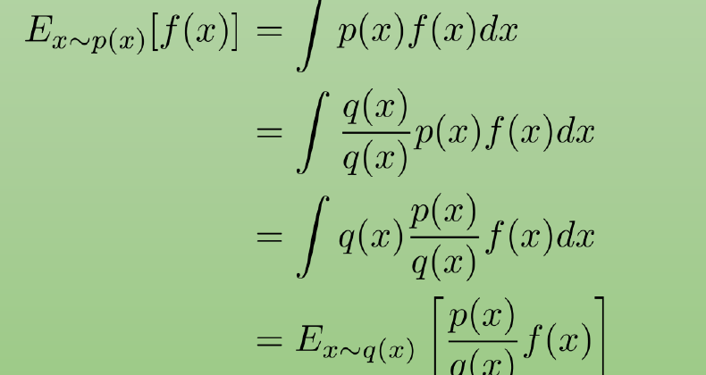
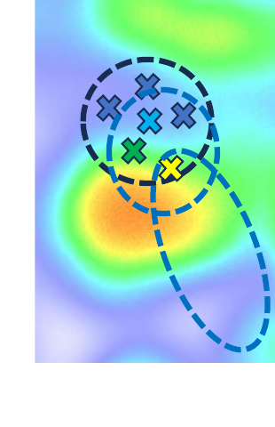
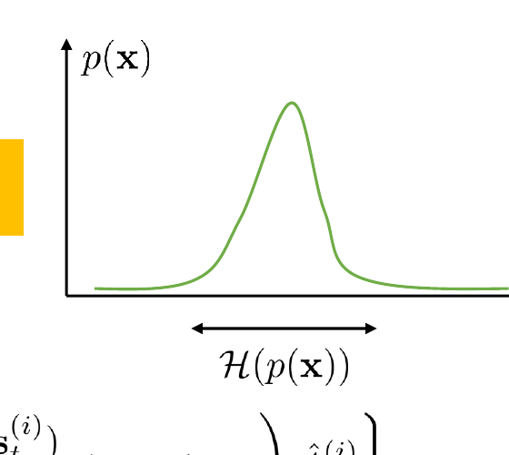

## Off-Policy Policy Gradient

### 1 Off-Policy Policy Gradient

CS 185/285

授课教师：Sergey Levine

UC Berkeley

## 第一部分：回到策略梯度

### 2 第一部分：回到策略梯度

回到策略梯度。

### 3 为什么我们喜欢策略梯度？

也叫 on-policy batch actor-critic。

带 GAE 的策略梯度：

1. 从 $\pi_\theta$ 中采样 $\{\tau^{(i)}\}$（运行策略）。
2. 计算 $y_t^{(i)} = r(s_t^{(i)}, a_t^{(i)}) + \hat V_\phi^\pi(s_{t+1}^{(i)})$。
3. 用目标 $\{y_t^{(i)}\}$ 来拟合 $\hat V_\phi^\pi(s)$。
4. 计算

$$
\hat A_{\mathrm{GAE}}^\pi(s_t^{(i)}, a_t^{(i)}) = \sum_{t'=t}^{\infty}(\gamma\lambda)^{t'-t}\delta_{t'}^{(i)}.
$$

5. 计算

$$
\nabla_\theta J(\theta)\approx \sum_i\sum_t \nabla_\theta \log \pi_\theta(a_t^{(i)}\mid s_t^{(i)}) \hat A^\pi(s_t^{(i)}, a_t^{(i)}).
$$

6. 更新参数

$$
\theta \leftarrow \theta + \alpha \nabla_\theta J(\theta).
$$

Q-function 方法可能很难调，而且未必会收敛。

对于 on-policy 方法，我们可以使用 Monte Carlo 优势估计器。

当 $\lambda = 1$ 时，
$$
\hat A_{\mathrm{MC}}^\pi(s_t, a_t)=\sum_{t'=t}^{\infty}\gamma^{t'-t} r(s_{t'}, a_{t'})-\hat V_\phi^\pi(s_t).
$$

这会给出一个可证明无偏的策略梯度估计器。

无论 critic 有多“错”，这一点都成立。

这使得策略梯度在我们想要一种稳定、可靠的 RL 方法，而又不太关心样本效率时，成为非常好的选择。

它尤其适合 sim-to-real 机器人，以及训练 LLM。

### 4 策略梯度的问题

也叫 on-policy batch actor-critic。

带 GAE 的策略梯度仍然遵循同样的流程：

1. 从 $\pi_\theta$ 中采样 $\{\tau^{(i)}\}$（运行策略）。
2. 计算 $y_t^{(i)} = r(s_t^{(i)}, a_t^{(i)}) + \hat V_\phi^\pi(s_{t+1}^{(i)})$。
3. 用目标 $\{y_t^{(i)}\}$ 来拟合 $\hat V_\phi^\pi(s)$。
4. 计算

$$
\hat A_{\mathrm{GAE}}^\pi(s_t^{(i)}, a_t^{(i)}) = \sum_{t'=t}^{\infty}(\gamma\lambda)^{t'-t}\delta_{t'}^{(i)}.
$$

5. 计算

$$
\nabla_\theta J(\theta)\approx \sum_i\sum_t \nabla_\theta \log \pi_\theta(a_t^{(i)}\mid s_t^{(i)}) \hat A^\pi(s_t^{(i)}, a_t^{(i)}).
$$

6. 更新参数

$$
\theta \leftarrow \theta + \alpha \nabla_\theta J(\theta).
$$

问题在于：每次迭代都只走一步梯度。

每次迭代都需要重新生成样本。

高方差意味着，相比常规监督学习，我们通常需要更大的 batch 和更小的学习率。

这会很快变得不可承受。

### 5 我们想看到的那类算法

虚构的“多步”策略梯度：

1. 从 $\pi_\theta$ 中采样 $\{\tau^{(i)}\}$（运行策略）。
2. 计算 $y_t^{(i)} = r(s_t^{(i)}, a_t^{(i)}) + \hat V_\phi^\pi(s_{t+1}^{(i)})$。
3. 用目标 $\{y_t^{(i)}\}$ 来拟合 $\hat V_\phi^\pi(s)$。
4. 计算

$$
\hat A_{\mathrm{GAE}}^\pi(s_t^{(i)}, a_t^{(i)}) = \sum_{t'=t}^{\infty}(\gamma\lambda)^{t'-t}\delta_{t'}^{(i)}.
$$

5. 将下面两步重复 $K$ 次：
   - 计算

$$
\nabla_\theta J(\theta)\approx \sum_i\sum_t \nabla_\theta \log \pi_\theta(a_t^{(i)}\mid s_t^{(i)}) \hat A^\pi(s_t^{(i)}, a_t^{(i)}).
$$

   - 更新参数

$$
\theta \leftarrow \theta + \alpha \nabla_\theta J(\theta).
$$

这里为什么不允许这么做？

我们能不能想办法对它进行修正，从而允许我们连续走多步？

上面的梯度项可以写成
$$
\mathbb E_{\tau \sim p_\theta(s_t, a_t)}\!\left[\nabla_\theta \log \pi_\theta(a_t\mid s_t)\hat A^\pi(s_t, a_t)\right]
=
\sum_{s_t,a_t} p_\theta(s_t, a_t)\nabla_\theta \log \pi_\theta(a_t\mid s_t)\hat A^\pi(s_t, a_t).
$$

## 第二部分：重要性采样

### 6 第二部分：重要性采样

重要性采样。

### 7 Off-policy 学习与重要性采样

$$
\theta^* = \arg\max_\theta J(\theta)
$$

$$
J(\theta) = \mathbb E_{\tau\sim p_\theta(\tau)}[r(\tau)].
$$

如果我们没有来自 $p_\theta(\tau)$ 的样本怎么办？

也就是说，我们手里只有某个 $\bar p(\tau)$ 的样本。

此时可以写成
$$
J(\theta)=\mathbb E_{\tau\sim \bar p(\tau)}\left[\frac{p_\theta(\tau)}{\bar p(\tau)}r(\tau)\right].
$$

其中
$$
p_\theta(\tau)=p(s_1)\prod_{t=1}^{H}\pi_\theta(a_t\mid s_t)\,p(s_{t+1}\mid s_t,a_t).
$$

因此
$$
\frac{p_\theta(\tau)}{\bar p(\tau)}
=
\frac{p(s_1)\prod_{t=1}^{H}\pi_\theta(a_t\mid s_t)p(s_{t+1}\mid s_t,a_t)}
{p(s_1)\prod_{t=1}^{H}\bar\pi(a_t\mid s_t)p(s_{t+1}\mid s_t,a_t)}
=
\frac{\prod_{t=1}^{H}\pi_\theta(a_t\mid s_t)}
{\prod_{t=1}^{H}\bar\pi(a_t\mid s_t)}.
$$

重要性采样的一般形式是
$$
\mathbb E_{x\sim p(x)}[f(x)]
=
\int p(x)f(x)\,dx
=
\int \frac{q(x)}{q(x)}p(x)f(x)\,dx
=
\int q(x)\frac{p(x)}{q(x)}f(x)\,dx
=
\mathbb E_{x\sim q(x)}\left[\frac{p(x)}{q(x)}f(x)\right].
$$

  
   
  [重要性采样的基本恒等式示意。]

### 8 用 IS 推导策略梯度

$$
\theta^* = \arg\max_\theta J(\theta)
$$

$$
J(\theta)=\mathbb E_{\tau\sim p_\theta(\tau)}[r(\tau)].
$$

我们能否估计某组新参数 $\theta'$ 的取值效果？

可以写成
$$
J(\theta')
=
\mathbb E_{\tau\sim p_\theta(\tau)}
\left[
\frac{p_{\theta'}(\tau)}{p_\theta(\tau)}r(\tau)
\right].
$$

这里唯一依赖于 $\theta'$ 的部分，就是比值中的 $p_{\theta'}(\tau)$。

于是
$$
\nabla_{\theta'}J(\theta')
=
\mathbb E_{\tau\sim p_\theta(\tau)}
\left[
\frac{\nabla_{\theta'}p_{\theta'}(\tau)}{p_\theta(\tau)}r(\tau)
\right]
=
\mathbb E_{\tau\sim p_\theta(\tau)}
\left[
\frac{p_{\theta'}(\tau)}{p_\theta(\tau)}\nabla_{\theta'}\log p_{\theta'}(\tau)\,r(\tau)
\right].
$$

一个方便的恒等式是
$$
p_\theta(\tau)\nabla_\theta \log p_\theta(\tau)=\nabla_\theta p_\theta(\tau).
$$

现在在局部处估计，也就是令 $\theta=\theta'$，则有
$$
\nabla_\theta J(\theta)
=
\mathbb E_{\tau\sim p_\theta(\tau)}
\left[
\nabla_\theta \log p_\theta(\tau)\,r(\tau)
\right].
$$

### 9 Off-policy 策略梯度

$$
\theta^* = \arg\max_\theta J(\theta)
$$

$$
J(\theta)=\mathbb E_{\tau\sim p_\theta(\tau)}[r(\tau)].
$$

当 $\theta\neq\theta'$ 时，
$$
\nabla_{\theta'}J(\theta')
=
\mathbb E_{\tau\sim p_\theta(\tau)}
\left[
\frac{p_{\theta'}(\tau)}{p_\theta(\tau)}
\nabla_{\theta'}\log p_{\theta'}(\tau)\,r(\tau)
\right].
$$

并且
$$
\frac{p_{\theta'}(\tau)}{p_\theta(\tau)}
=
\frac{\prod_{t=1}^{H}\pi_{\theta'}(a_t\mid s_t)}
{\prod_{t=1}^{H}\pi_\theta(a_t\mid s_t)}.
$$

进一步展开可得
$$
\nabla_{\theta'}J(\theta')
=
\mathbb E_{\tau\sim p_\theta(\tau)}
\left[
\left(\prod_{t=1}^{H}\frac{\pi_{\theta'}(a_t\mid s_t)}{\pi_\theta(a_t\mid s_t)}\right)
\left(\sum_{t=1}^{H}\nabla_{\theta'}\log \pi_{\theta'}(a_t\mid s_t)\right)
\left(\sum_{t=1}^{H}r(s_t,a_t)\right)
\right].
$$

再利用因果性，可以把它写成
$$
\nabla_{\theta'}J(\theta')
=
\mathbb E_{\tau\sim p_\theta(\tau)}
\left[
\sum_{t=1}^{H}\nabla_{\theta'}\log \pi_{\theta'}(a_t\mid s_t)
\left(\prod_{t'=1}^{t}\frac{\pi_{\theta'}(a_{t'}\mid s_{t'})}{\pi_\theta(a_{t'}\mid s_{t'})}\right)
\left(\sum_{t'=t}^{H}r(s_{t'},a_{t'})\right)
\right].
$$

这里的关键点是：未来动作不会影响当前权重。

如果忽略这一点，就会得到一个 policy iteration 算法；下一次课会继续讲这一点。

### 10 IS 的一阶近似

$$
\nabla_{\theta'}J(\theta')
=
\mathbb E_{\tau\sim p_\theta(\tau)}
\left[
\sum_{t=1}^{H}\nabla_{\theta'}\log \pi_{\theta'}(a_t\mid s_t)
\left(\prod_{t'=1}^{t}\frac{\pi_{\theta'}(a_{t'}\mid s_{t'})}{\pi_\theta(a_{t'}\mid s_{t'})}\right)
\left(\sum_{t'=t}^{H}r(s_{t'},a_{t'})\right)
\right].
$$

上式里的乘积项会随着 $T$ 指数增长。

我们把目标稍微换一种写法。

On-policy 策略梯度：
$$
\nabla_\theta J(\theta)
\approx
\frac{1}{N}\sum_{i=1}^{N}\sum_{t=1}^{H}
\nabla_\theta\log \pi_\theta(a_t^{(i)}\mid s_t^{(i)})\hat A_t^{(i)}.
$$

其中
$$
(s_t^{(i)},a_t^{(i)})\sim \pi_\theta(s_t,a_t).
$$

Off-policy 策略梯度：
$$
\nabla_{\theta'}J(\theta')
\approx
\frac{1}{N}\sum_{i=1}^{N}\sum_{t=1}^{H}
\frac{\pi_{\theta'}(s_t^{(i)},a_t^{(i)})}{\pi_\theta(s_t^{(i)},a_t^{(i)})}
\nabla_{\theta'}\log \pi_{\theta'}(a_t^{(i)}\mid s_t^{(i)})\hat A_t^{(i)}.
$$

把联合分布拆开，可以写成
$$
=
\frac{1}{N}\sum_{i=1}^{N}\sum_{t=1}^{H}
\frac{\pi_{\theta'}(s_t^{(i)})}{\pi_\theta(s_t^{(i)})}
\frac{\pi_{\theta'}(a_t^{(i)}\mid s_t^{(i)})}{\pi_\theta(a_t^{(i)}\mid s_t^{(i)})}
\nabla_{\theta'}\log \pi_{\theta'}(a_t^{(i)}\mid s_t^{(i)})\hat A_t^{(i)}.
$$

这里我们“有一点点不严谨”地忽略掉状态分布比值这一部分。

下一次课会看到，为什么这么做在大多数情况下基本是可以接受的。

### 11 我们想看到的那类算法

真正的“多步”策略梯度：

1. 从 $\pi_\theta$ 中采样 $\{\tau^{(i)}\}$（运行策略）。
2. 计算 $y_t^{(i)} = r(s_t^{(i)}, a_t^{(i)}) + \hat V_\phi^\pi(s_{t+1}^{(i)})$。
3. 用目标 $\{y_t^{(i)}\}$ 来拟合 $\hat V_\phi^\pi(s)$。
4. 计算

$$
\hat A_{\mathrm{GAE}}^\pi(s_t^{(i)}, a_t^{(i)}) = \sum_{t'=t}^{\infty}(\gamma\lambda)^{t'-t}\delta_{t'}^{(i)}.
$$

5. 令 $\theta' \leftarrow \theta$。
6. 将下面两步重复 $K$ 次：
   - 计算

$$
\nabla_{\theta'}J(\theta')
\approx
\sum_{i=1}^{N}\sum_{t=1}^{H}
\frac{\pi_{\theta'}(a_t^{(i)}\mid s_t^{(i)})}{\pi_\theta(a_t^{(i)}\mid s_t^{(i)})}
\nabla_{\theta'}\log \pi_{\theta'}(a_t^{(i)}\mid s_t^{(i)})\hat A_t^{(i)}.
$$

- 更新参数

$$
\theta' \leftarrow \theta' + \alpha \nabla_{\theta'}J(\theta').
$$

7. 最后令 $\theta \leftarrow \theta'$。

## 第三部分：让重要性采样真正奏效

### 12 第三部分：让重要性采样真正奏效

让重要性采样真正奏效。

### 13 仍然存在一个问题

实际上的“多步”策略梯度仍然是：

1. 从 $\pi_\theta$ 中采样 $\{\tau^{(i)}\}$（运行策略）。
2. 计算 $y_t^{(i)} = r(s_t^{(i)}, a_t^{(i)}) + \hat V_\phi^\pi(s_{t+1}^{(i)})$。
3. 用目标 $\{y_t^{(i)}\}$ 来拟合 $\hat V_\phi^\pi(s)$。
4. 计算

$$
\hat A_{\mathrm{GAE}}^\pi(s_t^{(i)}, a_t^{(i)}) = \sum_{t'=t}^{\infty}(\gamma\lambda)^{t'-t}\delta_{t'}^{(i)}.
$$

5. 令 $\theta' \leftarrow \theta$。
6. 将下面两步重复 $K$ 次：
   - 计算

$$
\nabla_{\theta'}J(\theta')
\approx
\sum_{i=1}^{N}\sum_{t=1}^{H}
\frac{\pi_{\theta'}(a_t^{(i)}\mid s_t^{(i)})}{\pi_\theta(a_t^{(i)}\mid s_t^{(i)})}
\nabla_{\theta'}\log \pi_{\theta'}(a_t^{(i)}\mid s_t^{(i)})\hat A_t^{(i)}.
$$

   - 更新参数

$$
\theta' \leftarrow \theta' + \alpha \nabla_{\theta'}J(\theta').
$$

7. 最后令 $\theta \leftarrow \theta'$。

但是仍然有一个问题：一旦权重偏离 1.0 太远，估计器就不再有用了。

更正式地说，它的方差会变得过高。

  
   
  [当重要性权重与 1 偏离过大时，更新会被拉向与数据分布相距更远的区域，方差迅速上升。]

### 14 裁剪的重要性权重

$$
J(\theta')
=
\mathbb E_{\tau\sim p_\theta(\tau)}
\left[
\frac{p_{\theta'}(\tau)}{p_\theta(\tau)}r(\tau)
\right].
$$

这可以看作一个“代理目标”（surrogate objective）。

于是
$$
\nabla_{\theta'}J(\theta')
=
\mathbb E_{\tau\sim p_\theta(\tau)}
\left[
\frac{p_{\theta'}(\tau)}{p_\theta(\tau)}
\nabla_{\theta'}\log p_{\theta'}(\tau)\,r(\tau)
\right].
$$

做法是把权重重新定义为
$$
w(\tau)
=
\max\left\{
1-\epsilon,\,
\min\left\{
1+\epsilon,\,
\frac{p_{\theta'}(\tau)}{p_\theta(\tau)}
\right\}
\right\}.
$$

实践中可以先试 $\epsilon=0.1$。

这样就给概率的增大和减小都加上了一个上限。

### 15 还有一个细节

仅仅裁剪
$$
J(\theta')
=
\mathbb E_{\tau\sim p_\theta(\tau)}[w(\tau)r(\tau)]
$$
还不够，因为在某些区域里，策略偏离数据分布时并没有继续付出代价。

因此目标改写为
$$
J(\theta')
=
\mathbb E_{\tau\sim p_\theta(\tau)}
\left[
\min\{w(\tau)r(\tau),\,w_c(\tau)r(\tau)\}
\right].
$$

其中
$$
w(\tau)=\frac{p_{\theta'}(\tau)}{p_\theta(\tau)}
$$
以及
$$
w_c(\tau)
=
\max\left\{
1-\epsilon,\,
\min\left\{
1+\epsilon,\,
\frac{p_{\theta'}(\tau)}{p_\theta(\tau)}
\right\}
\right\}.
$$

右侧两幅图分别对应 $r(\tau)>0$ 和 $r(\tau)<0$ 的情况，表达的是：一旦越过剪切阈值，目标函数就不再继续鼓励朝着远离数据的方向移动。

### 16 带裁剪重要性采样的策略梯度

带 clipped IS（PPO）的策略梯度：

1. 从 $\pi_\theta$ 中采样 $\{\tau^{(i)}\}$（运行策略）。
2. 计算 $y_t^{(i)} = r(s_t^{(i)}, a_t^{(i)}) + \hat V_\phi^\pi(s_{t+1}^{(i)})$。
3. 用目标 $\{y_t^{(i)}\}$ 来拟合 $\hat V_\phi^\pi(s)$。
4. 计算

$$
\hat A_{\mathrm{GAE}}^\pi(s_t^{(i)}, a_t^{(i)}) = \sum_{t'=t}^{\infty}(\gamma\lambda)^{t'-t}\delta_{t'}^{(i)}.
$$

5. 令 $\theta' \leftarrow \theta$。
6. 将下面两步重复 $K$ 次：
   - 计算

$$
\nabla_{\theta'}J(\theta')\approx \nabla_{\theta'}\mathcal L_{\mathrm{CLIP}}(\theta').
$$

   - 更新参数

$$
\theta' \leftarrow \theta' + \alpha \nabla_{\theta'}J(\theta').
$$

7. 最后令 $\theta \leftarrow \theta'$。

对应的目标函数为
$$
\mathcal L_{\mathrm{CLIP}}(\theta')
=
\sum_{i=1}^{N}\sum_{t=1}^{H}
\min\left\{
\frac{\pi_{\theta'}(a_t^{(i)}\mid s_t^{(i)})}{\pi_\theta(a_t^{(i)}\mid s_t^{(i)})}\hat A_t^{(i)},
\operatorname{clip}\left(
\frac{\pi_{\theta'}(a_t^{(i)}\mid s_t^{(i)})}{\pi_\theta(a_t^{(i)}\mid s_t^{(i)})},
1-\epsilon,
1+\epsilon
\right)\hat A_t^{(i)}
\right\}.
$$

还有几点补充细节：

使用 GAE 来计算 $y_t^{(i)}$。

在目标里加入
$$
\sum_i\sum_t \mathcal H\!\left(\pi_{\theta'}(\cdot\mid s_t^{(i)})\right)
$$
这一项，也就是“entropy regularization”。

最终就得到被广泛使用的 PPO 算法。

  
   
  [熵正则化鼓励策略保持更宽的分布，从而提升探索性并抑制过早塌缩。]

